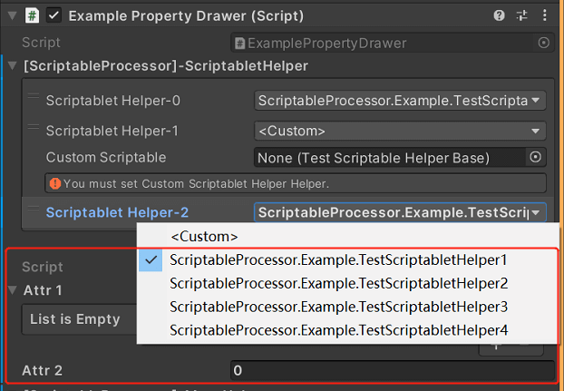
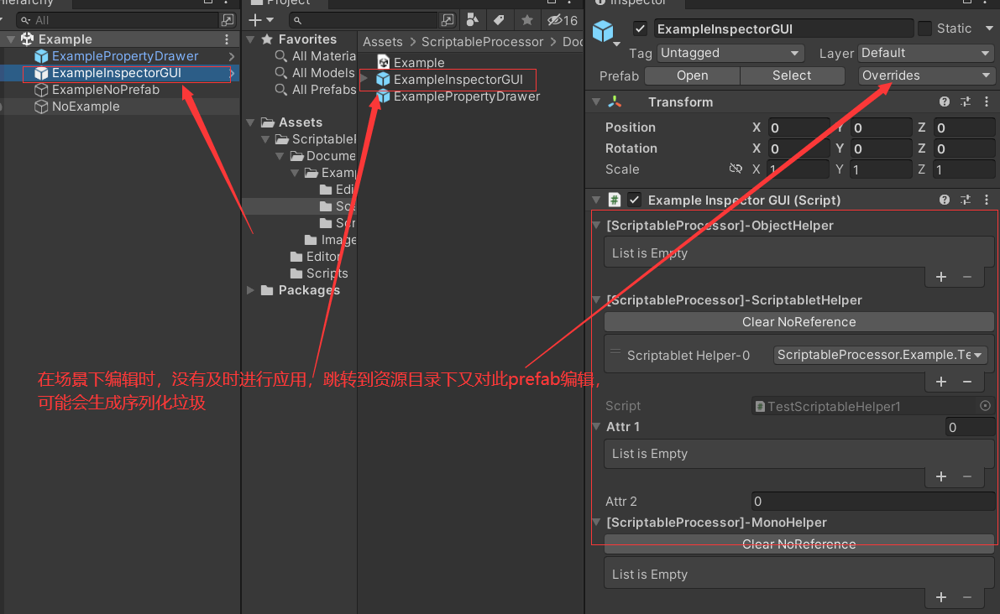

# ScriptableProcessor
# 1.插件说明 
Hi！ 伙计，是否遇到过这种情况，假设工程里存在DataTableHelperBase.cs抽象基类，继承基类的父类有(TxtDataTableHelper、CsvDataTableHelper、XmlDataTableHelper、JsonDataTableHelper)等，希望通过监视面板动态创建和设置这些父类，但是很可惜目前著名的Odin插件不存在这个功能。
ScriptableProcessor就是解决以上问题的插件，通过反射可多次快速的把这些父类进行序列化的管理插件，并提供友好方便的监视面板进行管理。

# 2.使用例子
工程中有两个例子ExampleInspectorGUI和ExamplePropertyDrawer脚本，具体初始化方式如下:
```
public class ExamplePropertyDrawer : MonoBehaviour
{
    [ScriptableProcessor]
    public ScriptableProcessor<TestScriptableHelperBase> ScriptabletHelper = new ScriptableProcessor<TestScriptableHelperBase>();

    void Start()
    {
        ScriptabletHelper[0].PrintTest();
        ScriptabletHelper[1].PrintTest();
    }
}
```
以上写法简单方便，接下来查看ScriptableProcessor<TestScriptableHelperBase>的监视面板样式，如下图：


下拉框中选项是通过反射获取到所有继承TestScriptableHelperBase的父类，当创建新父类时，开发人员不需要改变任何东西，监视面板中就会多出创建的父类选型，选中父类时，红色框内属性就是此父类可序列化编辑的属性。

# 3.定制父类监视面板
父类属性面板默认采用Unity样式显示，假设需要定制TestScriptabletHelper1监视面板时，ScriptableProcessor也是提供支持的，可编写如下脚本：
```
[ScriptableInspectorAttribute(typeof(TestScriptabletHelper1))]
public class TestScriptabletHelper1Inspector : SerializedInspectorBase
{
    public override void Init(SerializedObject serializedObject)
    {
        throw new NotImplementedException();
    }

    public override void Draw()
    {
        throw new System.NotImplementedException();
    }

    public override void Draw(Rect beginPos)
    {
        throw new System.NotImplementedException();
    }

    public override void Refresh()
    {
        throw new NotImplementedException();
    }
}
```
具体可参考ScriptableProcessorInspector。

# 4.注意事项
* 编辑监视面板时，不要一边在场景下编辑，一边又跳转到资源目录下编辑，可能会生成序列化的垃圾(此序列化数据可能不被插件内部使用，可手动删掉)。所以在场景下编辑时，及时保存再到资源目录下编辑即可。
* 插件支持ScriptableObject，MonoBehaviour控制序列化的管理，不继承以上类时，插件将在启动时反射创建类实例。

