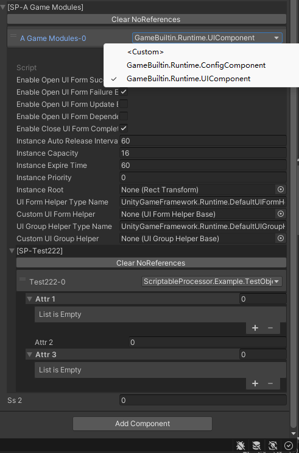

# ScriptableProcessor
# 1.Introduce
Hi there! Have you ever encountered a situation where there is an abstract base class called DataTableHelperBase in the project, with parent classes such as TxtDataTableHelper, CsvDataTableHelper, XmlDataTableHelper, JsonDataTableHelper, etc.? And you wish to dynamically select and set parameters for the parent class directly in the inspector panel.
ScriptableProcessor is the plugin that solves the above problem. It allows for quick serialization and management of these parent classes through reflection, and provides a user-friendly inspector panel for easy management.
Note: This version is mainly used for learning. If conditions permit, use Odin Inspector directly. It is a more powerful and comprehensive plugin.

# 2.Examples
In the project, there are two example scripts: ExampleInspectorGUI and ExamplePropertyDrawer. The specific initialization methods are as follows:
```
public class ExamplePropertyDrawer : MonoBehaviour
{
    [ScriptableProcessor]
    public ScriptableProcessor<TestScriptableHelperBase> ScriptabletHelper = new ScriptableProcessor<TestScriptableHelperBase>();

    void Start()
    {
        ScriptabletHelper[0].PrintTest();
        ScriptabletHelper[1].PrintTest();
    }
}
```
The above approach is simple, and results in the final inspector panel style for ScriptableProcessor<TestScriptableHelperBase> as shown in the following image:


The dropdown options are obtained through reflection, including all parent classes that inherit from TestScriptableHelperBase. When a new parent class is created, developers do not need to make any changes; the inspector panel will automatically display the newly created parent class as an option. When a parent class is selected, the properties that can be serialized and edited for this parent class will be displayed in the red box.

# 3.Finetune inspector
[ScriptableProcessor(isLock, isHeader, indentLevel)] Explanation of the three parameters:
- isLock Whether to disable the add and delete buttons, and only display a single selection.
- isHeader Whether to remove the header and not display collapsing.
- indentLevel Indentation when drawing ScriptableProcessor.


# 4.Precautions
* If you need to reflect objects from other assemblies, modify the configuration in the AssemblyExt script yourself.
* If the base class is not ScriptableObject or MonoBehaviour, the Custom option will not appear.